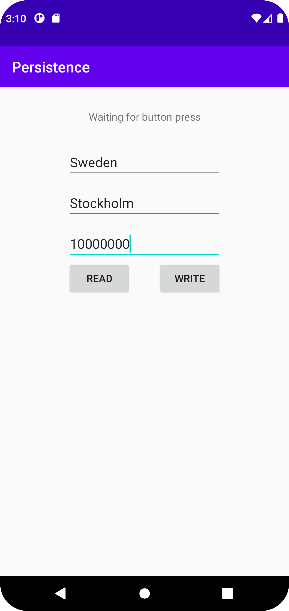
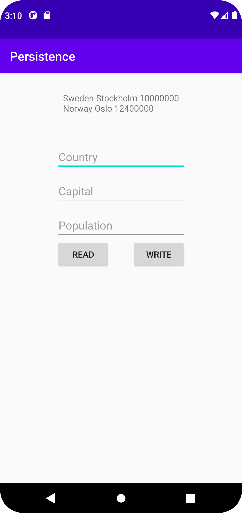

# Rapport

Skapade en layout med en textvy, tre inputfält och två knappar, en knapp som skriver till databasen och en som läser från den.
Skapade sedan två klasser en för att definera tablerna som ska finnas i databasen och en för att skapa databasen.
Sedan skapades en klass country för att kunna skapa ett objekt av det som lagras i databasen.
Slutligen så skapades metoderna för att läsa och skriva till databasen beroende på vilken knapp som klickats på.

Kodstycket får in en lista av countries, är listan tom ska texten i textviewn sättas till no data in database.
Finns det data i countries loopas den igenom och namnet, huvudstaden och folkmängden hämtas och sparas i en strän.
Texten i textviewn sätts sedan till den sparade strängen.
```
private void writeToActivity(final List<Country> countries) {
    TextView tv_display = findViewById(R.id.tv_display);

    if (countries.isEmpty()) {
        tv_display.setText("No data in database");
        return;
    }

    String text = "";

    for (Country country : countries) {
        text += country.getName() + " " + country.getCapital() + " " + country.getPopulation() + "\n";
    }

    tv_display.setText(text);
}
```




Läs gärna:

- Boulos, M.N.K., Warren, J., Gong, J. & Yue, P. (2010) Web GIS in practice VIII: HTML5 and the canvas element for interactive online mapping. International journal of health geographics 9, 14. Shin, Y. &
- Wunsche, B.C. (2013) A smartphone-based golf simulation exercise game for supporting arthritis patients. 2013 28th International Conference of Image and Vision Computing New Zealand (IVCNZ), IEEE, pp. 459–464.
- Wohlin, C., Runeson, P., Höst, M., Ohlsson, M.C., Regnell, B., Wesslén, A. (2012) Experimentation in Software Engineering, Berlin, Heidelberg: Springer Berlin Heidelberg.
